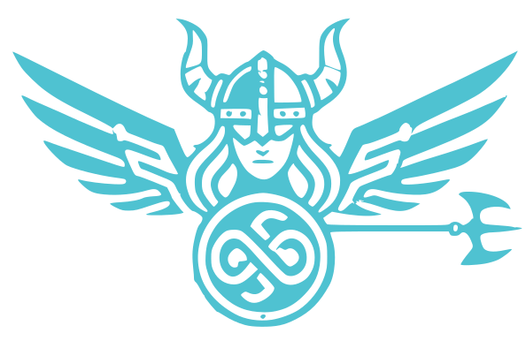

# ValkiriApps Web

  

  **Soluciones web y automatizaciones a medida**

  
  
  
  

## 📋 Tabla de Contenidos

- [Descripción](#-descripción)
- [Características](#-características)
- [Tecnologías](#-tecnologías)
- [Estructura del Proyecto](#-estructura-del-proyecto)
- [Instalación](#-instalación)
- [Scripts Disponibles](#-scripts-disponibles)
- [Configuración](#-configuración)
- [Desarrollo](#-desarrollo)
- [Despliegue](#-despliegue)
- [Contribuir](#-contribuir)

## 🎯 Descripción

**ValkiriApps Web** es un sitio web corporativo moderno construido con Next.js 15 y React 19, diseñado para mostrar soluciones digitales y automatizaciones a medida. El proyecto presenta una experiencia visual impactante con animaciones avanzadas usando GSAP, Three.js, y WebGL.

## ✨ Características

- **🎨 Animaciones Avanzadas**: WebGL shaders personalizados, efectos de partículas, y scroll animations
- **⚡ Smooth Scrolling**: Integración de Lenis para scroll fluido con física de inercia
- **🎭 Componentes Interactivos**: Navegación "gooey", hero con WebGL, y secciones animadas
- **📱 Responsive Design**: Diseño adaptable para todos los dispositivos
- **🔥 Performance**: Optimización de imágenes con Next.js Image, lazy loading
- **♿ Accesibilidad**: Soporte de teclado, ARIA labels, y semántica HTML correcta
- **🎯 TypeScript**: Type-safe con TypeScript 5.x
- **🎨 CSS Moderno**: CSS Modules, Custom Properties, y arquitectura escalable

## 🛠️ Tecnologías

### Core
- **[Next.js 15.4.4](https://nextjs.org/)** - Framework React con App Router
- **[React 19.1.0](https://reactjs.org/)** - Biblioteca UI
- **[TypeScript 5.x](https://www.typescriptlang.org/)** - JavaScript con tipos

### Animaciones
- **[GSAP 3.13.0](https://greensock.com/gsap/)** - Animaciones profesionales
- **[Lenis 1.0.42](https://lenis.studiofreight.com/)** - Smooth scrolling
- **[Framer Motion 12.23.12](https://www.framer.com/motion/)** - Animaciones React
- **[Three.js 0.178.0](https://threejs.org/)** - 3D y WebGL
- **[React Three Fiber 9.3.0](https://docs.pmnd.rs/react-three-fiber/)** - Three.js en React
- **[OGL 1.0.11](https://github.com/oframe/ogl)** - WebGL minimalista

### Estilos
- **CSS Modules** - Estilos con scope local
- **CSS Custom Properties** - Variables CSS para theming
- **Google Fonts** - Geist Sans & Geist Mono

## 📁 Estructura del Proyecto

\`\`\`
valkiriappsWeb/
├── public/                      # Archivos estáticos
│   ├── images/                  # Imágenes optimizadas
│   │   ├── logos/              # Logos de la marca
│   │   └── screenshots/        # Capturas y mockups
│   └── fonts/                   # Fuentes personalizadas
├── src/
│   ├── app/                     # Next.js App Router
│   │   ├── layout.tsx          # Layout principal
│   │   ├── page.tsx            # Página home
│   │   └── favicon.ico         # Favicon
│   ├── components/              # Componentes React
│   │   ├── layout/             # Componentes de layout
│   │   │   ├── ClientSmoothScroll.tsx
│   │   │   └── Navbar/
│   │   ├── sections/           # Secciones de página
│   │   │   ├── Hero/
│   │   │   └── Mision/
│   │   ├── animations/         # Componentes de animación
│   │   └── ui/                 # Componentes UI reutilizables
│   ├── hooks/                   # Custom React Hooks
│   │   ├── useSmoothScroll.ts
│   │   ├── useWindowSize.ts
│   │   └── index.ts
│   ├── utils/                   # Funciones utilitarias
│   │   ├── animation.ts
│   │   ├── cn.ts
│   │   └── index.ts
│   ├── types/                   # TypeScript types
│   │   └── index.ts
│   ├── constants/               # Constantes de la app
│   │   ├── company.ts
│   │   ├── navigation.ts
│   │   ├── theme.ts
│   │   └── index.ts
│   ├── styles/                  # Estilos globales
│   │   ├── globals.css
│   │   ├── variables.css
│   │   └── mixins.css
│   └── lib/                     # Configuraciones de librerías
├── .env.example                 # Variables de entorno ejemplo
├── next.config.ts               # Configuración Next.js
├── tsconfig.json                # Configuración TypeScript
├── eslint.config.mjs            # Configuración ESLint
├── package.json                 # Dependencias
└── README.md                    # Este archivo
\`\`\`

## 🚀 Instalación

### Prerrequisitos

- Node.js 18.x o superior
- npm, yarn, pnpm, o bun

### Pasos

1. **Clonar el repositorio**
   \`\`\`bash
   git clone https://github.com/tu-usuario/valkiriappsWeb.git
   cd valkiriappsWeb
   \`\`\`

2. **Instalar dependencias**
   \`\`\`bash
   npm install
   # o
   yarn install
   # o
   pnpm install
   \`\`\`

3. **Configurar variables de entorno** (opcional)
   \`\`\`bash
   cp .env.example .env.local
   # Edita .env.local con tus valores
   \`\`\`

4. **Ejecutar el servidor de desarrollo**
   \`\`\`bash
   npm run dev
   \`\`\`

5. **Abrir en el navegador**

   Visita [http://localhost:3000](http://localhost:3000)

## 📜 Scripts Disponibles

\`\`\`bash
npm run dev      # Inicia servidor de desarrollo (puerto 3000)
npm run build    # Crea build de producción
npm start        # Ejecuta servidor de producción
npm run lint     # Ejecuta ESLint para verificar código
\`\`\`

## ⚙️ Configuración

### Variables de Entorno

Crea un archivo \`.env.local\` en la raíz del proyecto:

\`\`\`env
NEXT_PUBLIC_APP_NAME=ValkiriApps
NEXT_PUBLIC_APP_URL=http://localhost:3000
\`\`\`

### Personalización

#### Cambiar Colores del Tema

Edita \`src/constants/theme.ts\`:

\`\`\`typescript
export const COLORS = {
  primary: "#00BFFF",     // Tu color primario
  secondary: "#4FC2D1",   // Tu color secundario
  // ...
};
\`\`\`

#### Modificar Navegación

Edita \`src/constants/navigation.ts\`:

\`\`\`typescript
export const NAVIGATION_ITEMS = [
  { label: "Home", href: "#home" },
  { label: "About", href: "#about" },
  // Agrega más items...
];
\`\`\`

#### Actualizar Información de la Empresa

Edita \`src/constants/company.ts\`:

\`\`\`typescript
export const COMPANY_INFO = {
  name: "Tu Empresa",
  tagline: "Tu tagline",
  // ...
};
\`\`\`

## 💻 Desarrollo

### Agregar un Nuevo Componente

1. Crear el componente en la carpeta apropiada:
   \`\`\`
   src/components/sections/MiNuevaSeccion/
   ├── MiNuevaSeccion.tsx
   ├── MiNuevaSeccion.module.css
   └── index.ts
   \`\`\`

2. Importar y usar en \`src/app/page.tsx\`:
   \`\`\`typescript
   import MiNuevaSeccion from "@/components/sections/MiNuevaSeccion";
   \`\`\`

### Crear un Custom Hook

1. Crear archivo en \`src/hooks/\`:
   \`\`\`typescript
   // src/hooks/useMiHook.ts
   export function useMiHook() {
     // Tu lógica aquí
   }
   \`\`\`

2. Exportar en \`src/hooks/index.ts\`:
   \`\`\`typescript
   export * from "./useMiHook";
   \`\`\`

### Agregar Utilidades

1. Crear función en \`src/utils/\`:
   \`\`\`typescript
   // src/utils/miUtil.ts
   export function miUtilidad() {
     // Tu función aquí
   }
   \`\`\`

2. Exportar en \`src/utils/index.ts\`

## 🌐 Despliegue

### Vercel (Recomendado)

1. Conecta tu repositorio a [Vercel](https://vercel.com)
2. Configura las variables de entorno
3. Despliega automáticamente con cada push

### Otros Proveedores

El proyecto puede desplegarse en cualquier plataforma que soporte Next.js:
- Netlify
- AWS Amplify
- Railway
- Render
- DigitalOcean App Platform

## 🤝 Contribuir

Las contribuciones son bienvenidas. Por favor:

1. Fork el proyecto
2. Crea una rama para tu feature (\`git checkout -b feature/AmazingFeature\`)
3. Commit tus cambios (\`git commit -m 'Add some AmazingFeature'\`)
4. Push a la rama (\`git push origin feature/AmazingFeature\`)
5. Abre un Pull Request

## 📝 Licencia

Este proyecto es privado y pertenece a ValkiriApps.

## 📧 Contacto

**ValkiriApps** - [Sitio Web](https://valkiriapps.com)

---

  Hecho con ❤️ por ValkiriApps

